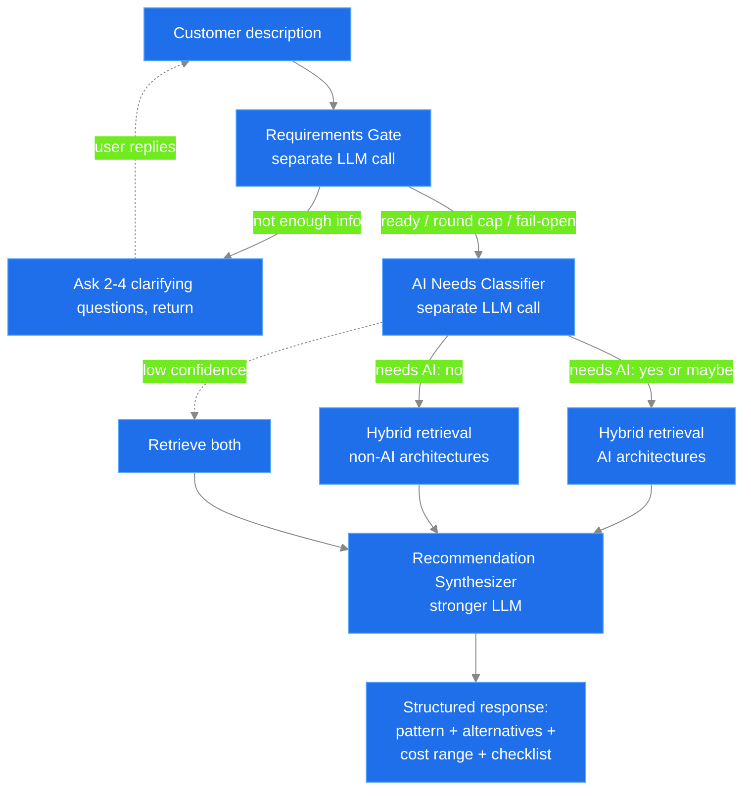

# Architecture Advisor Extension

> **Phase 1 MVP** — Helps customers decide if their application/workflow idea
> requires AI, or if an existing Azure architecture pattern from the
> [Azure Architecture Center](https://learn.microsoft.com/en-us/azure/architecture/browse/)
> already solves the problem.

## What this is

A pivot of the GPT-RAG solution accelerator into an **architecture advisor**
that:

1. Takes a free-form customer description of an app/workflow idea.
2. Runs a multi-turn **requirements gate** that asks 2-4 clarifying questions
   when the description is too thin, then consolidates the dialog into a single
   enriched problem statement before recommending. The gate **fails open** —
   if the model errors or the round cap is reached it proceeds to recommend.
3. Runs a dedicated LLM **classifier** to assess *"Does this need AI?"*
   (yes / maybe / no + confidence + rationale).
4. Retrieves the most relevant patterns from an indexed copy of the Azure
   Architecture Center catalog (or, later, a customer-specific service
   catalog).
5. Synthesizes a recommendation: **primary pattern + AI-vs-non-AI
   alternatives + cost range + implementation checklist + next steps.**

The gate, classifier, and synthesizer each run as **separate LLM calls** and
stream progress feedback to the UI so the user sees activity during the
multi-second synthesis step.

The scaffolding in this folder is **drop-in code** that targets the existing
component repositories — it is not meant to be deployed from this folder
directly.

## Folder layout

```
architecture-advisor/
├── README.md                              # This file
├── orchestrator/                          # Drop into gpt-rag-orchestrator/src/
│   ├── strategies/
│   │   └── architecture_advisor_strategy.py
│   ├── classifier/
│   │   ├── __init__.py
│   │   ├── ai_needs_classifier.py
│   │   └── models.py
│   ├── recommender/
│   │   ├── __init__.py
│   │   └── recommendation_synthesizer.py
│   └── prompts/
│       ├── classifier_system.txt
│       ├── classifier_examples.jsonl
│       ├── gate_system.txt                # Requirements-gate system prompt
│       └── synthesizer_template.txt
├── ingestion/                             # Drop into gpt-rag-ingestion/
│   ├── jobs/
│   │   ├── __init__.py
│   │   └── architecture_center_indexer.py
│   ├── chunking/chunkers/
│   │   └── architecture_chunker.py
│   └── config/
│       └── learn_scraper_config.json
├── config/                                # Drop into gpt-rag root config/
│   └── search/
│       └── architecture-index.j2          # New AI Search index definition
└── docs/
    └── ADR-001-classifier-first-flow.md   # Architecture decision record
```

## Where the code goes (deployment mapping)

| Module | Target Repo | Target Path |
|--------|-------------|-------------|
| `orchestrator/strategies/architecture_advisor_strategy.py` | `Azure/gpt-rag-orchestrator` | `src/strategies/` |
| `orchestrator/classifier/` | `Azure/gpt-rag-orchestrator` | `src/classifier/` |
| `orchestrator/recommender/` | `Azure/gpt-rag-orchestrator` | `src/recommender/` |
| `orchestrator/prompts/` | `Azure/gpt-rag-orchestrator` | `src/prompts/` (merge) |
| `ingestion/jobs/architecture_center_indexer.py` | `Azure/gpt-rag-ingestion` | `jobs/` |
| `ingestion/chunking/chunkers/architecture_chunker.py` | `Azure/gpt-rag-ingestion` | `chunking/chunkers/` |
| `config/search/architecture-index.j2` | `Azure/gpt-rag` (this repo) | `config/search/` (or merge into `search.j2`) |

After moving files, register the new strategy in
`gpt-rag-orchestrator/src/strategies/agent_strategies.py` and
`agent_strategy_factory.py`, and add the new chunker to the
`gpt-rag-ingestion/chunking/chunker_factory.py`.

## Configuration keys to add (Azure App Configuration, label `gpt-rag`)

| Key | Default | Description |
|-----|---------|-------------|
| `AGENT_STRATEGY` | `architecture_advisor` | Activates this flow in the orchestrator. |
| `ARCH_ADVISOR_GATE_DEPLOYMENT` | `{{CHAT_DEPLOYMENT_NAME}}` | Model used for the requirements-gate LLM call. |
| `ARCH_ADVISOR_MAX_QUESTION_ROUNDS` | `2` | Max clarifying-question rounds before the gate proceeds to recommend. |
| `ARCH_ADVISOR_CLASSIFIER_DEPLOYMENT` | `gpt-4o-mini` | Lightweight model used for the classifier LLM call. |
| `ARCH_ADVISOR_SYNTHESIZER_DEPLOYMENT` | `gpt-4o` | Stronger model used for recommendation synthesis. |
| `ARCH_ADVISOR_CLASSIFIER_THRESHOLD` | `0.6` | Confidence below which we always run RAG retrieval as a fallback. |
| `ARCH_ADVISOR_TOP_K` | `6` | Number of candidate patterns retrieved per query. |
| `SEARCH_ARCHITECTURE_INDEX_NAME` | `architecture-{{RESOURCE_TOKEN}}` | AI Search index holding the Architecture Center catalog. |
| `LEARN_ARCHITECTURE_BROWSE_URL` | `https://learn.microsoft.com/en-us/azure/architecture/browse/` | Source URL for the ingester. |
| `LEARN_ARCHITECTURE_INGEST_SCHEDULE` | `0 3 * * 0` | Weekly Sunday 03:00 re-ingest. |

> **Reasoning-model note:** when the classifier/gate/synthesizer deployments
> point at a GPT-5-class reasoning model (e.g. `gpt-5.4-nano`), the calls use
> `reasoning_effort="low"` + `max_completion_tokens` + `timeout` and omit a
> custom `temperature` (only the default is accepted). This prevents unbounded
> reasoning from hanging the synthesis step.

## End-to-end flow



The gate keeps multi-turn state in the conversation document, so each clarifying
round re-enters at the top with the accumulated dialog. After a recommendation
is produced the round counter resets, allowing a follow-up question to
re-qualify from scratch.

## Phase 1 scope (this scaffold)

- [x] Multi-turn **requirements gate** that asks clarifying questions and
      consolidates the dialog before recommending (fails open).
- [x] Classifier as a **separate LLM call** with confidence and rationale.
- [x] Ingestion pipeline scaffold for Azure Architecture Center.
- [x] Strategy orchestrator wiring gate → classifier → retrieval → synthesizer.
- [x] Streamed progress feedback so the UI isn't silent during synthesis.
- [x] Structured recommendation output with alternatives + checklist.
- [x] Search index schema for architecture patterns.

## Phase 2 ideas (not in this scaffold)

- Pluggable customer service catalog ingester.
- "Deep dive" retrieval for follow-up questions (re-use existing
  `single_agent_rag` strategy from gpt-rag-orchestrator).
- Cost estimator tool (Azure pricing API) wired as a Semantic Kernel plugin.
- Architecture diff tool: *"Given pattern X, what changes if I add
  requirement Y?"*

See [`docs/ADR-001-classifier-first-flow.md`](./docs/ADR-001-classifier-first-flow.md)
for the design rationale.
